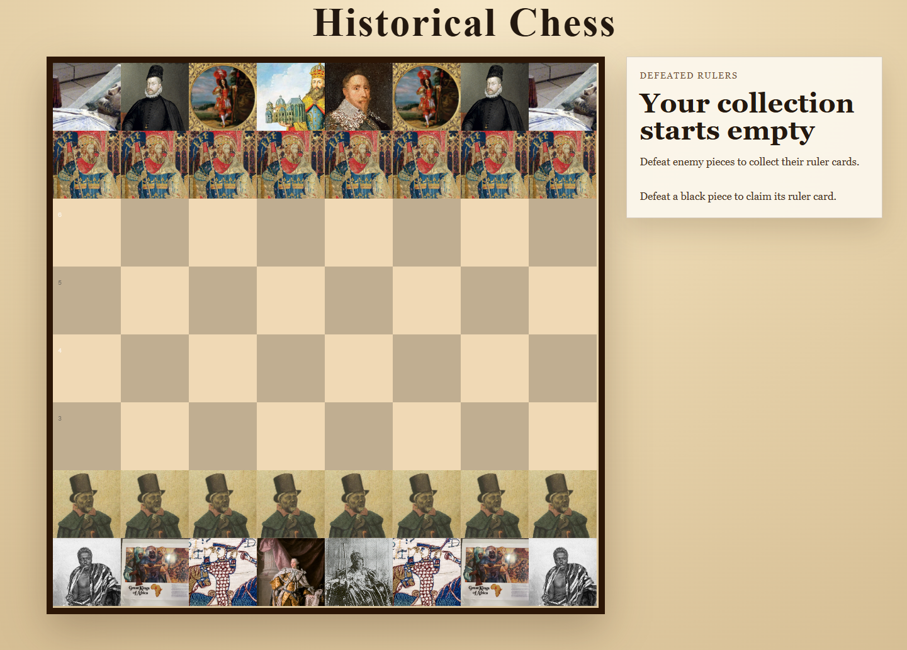

# Chess Game Frontend

A simple web-based chess game frontend built with [chess.js](https://github.com/jhlywa/chess.js) and [chessground](https://github.com/lichess-org/chessground).  
The game supports basic gameplay between a human player and a computer opponent that picks random legal moves.

---

## Features

- Visual chessboard rendered with Chessground
- Chess logic and move validation using Chess.js
- Computer opponent makes random valid moves
- Handles user moves with promotion support (always promotes to queen)
- Displays current turn and updates board position dynamically

---

## Demo



---

## Usage

1. Clone or download the repository, then open `index.html` in your browser:

```bash
git clone https://github.com/BaseMax/chess-game-frontend.git
cd chess-game-frontend
```

2. Open index.html

## File Structure

```
chess-game-frontend/
├── css/
│   ├── chessground.base.css
│   ├── chessground.brown.css
│   ├── chessground.cburnett.css
│   └── style.css
├── js/
│   ├── chess.min.js
│   ├── chessground.min.js
│   └── script.js
├── index.html
└── README.md
```

## How it works

- `index.html` loads the stylesheets and scripts for Chessground and Chess.js.
- `script.js` contains the game logic, including:

Initializing the chess game and board.

Handling user moves.

Computing the computer move by selecting a random legal move.

Updating the board state after each move.

## Dependencies

- `chess.js` — JavaScript chess library for move validation and game state.
- `chessground` — Chessboard UI component.

Both libraries are included in the `js/` folder.

## License

MIT License © 2025 Max Base
